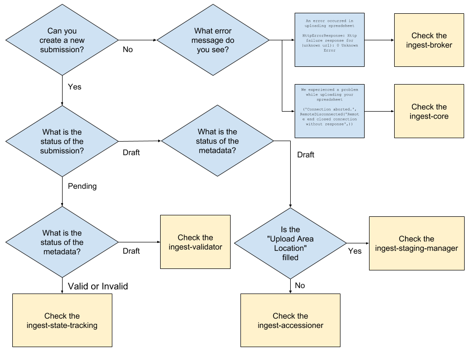

# Release Manager Runbook

Pointers for the release manager

## Emergency Shutdown (Red Button)
In the case that ingest needs to shut down immediately scale all pods for deployments in the environment to 0.

This procedure can also be used as a reset if the cluster is overloaded and pods are failing on mass. 

```
kubectl scale --replicas=0 deployments --all
```
To restore reapply the deployments and allow pods to scale to the previous level.
```
kubectl apply -f ./deployments/
```
*WARNING* - Avoid scaling down the stateful sets as this should not be necessary. If you do scale down the statefulsets also scale down deployments and make sure the statefulsets are restored and fully running before restoring the deployments.

## Cluster Failure
If nodes on the cluster fail we are likely to see pods with the status unknown. e.g.
```
kubectl get pods -o wide | grep Unknown
ingest-accessioner-5b898964d7-qlflf       0/1       Unknown             2          22h       100.96.4.5     ip-172-20-110-97.ec2.internal
ingest-broker-69b4447778-t7w88            0/1       Unknown             0          22h       <none>         ip-172-20-110-97.ec2.internal
```
This appears to be a [known bug](https://github.com/kubernetes/kubernetes/issues/43279) put down to the Docker daemon on a node failing with the suggested solution to be to restart all nodes. The cause is suggested to be too many pods restarting at one time leading to a node running out of resources.

### Solution
Stop the failing node or if that cannot be determined all nodes in the AWS EC2 console. The autoscaling group will then create new nodes. It will take approximately 10 minutes for the cluster to become ready and pods to be created.

## Debugging Failure 
Please look here is you experience an error and then check the state of the Kubernetes cluster.

These are the errors to expect if services are unavailable.

Below is a flowchart that helps debug errors.



### Ingest Accessioner Unavailable

#### UI
The submission and all metadata will appear "stuck" in draft.

#### Integration Test
Test will time out with submission in draft.
```
0:00:41 WAIT FOR VALIDATION...
0:00:41 envelope status is Draft
```

### Ingest Broker Unavailable

#### UI
Uploading a spreadsheet will take over 30 seconds and fail with the message:
```
An error occurred in uploading spreadsheet

HttpErrorResponse: Http failure response for (unknown url): 0 Unknown Error
```

#### Integration Test
Uploading spreadsheet will fail:
```
0:00:00 CREATING SUBMISSION with Q4DemoSS2Metadata_v5_plainHeaders_new.xlsx...

...

http.client.RemoteDisconnected: Remote end closed connection without response
```

### Ingest Core Unavailable

#### UI
The list of submission on the welcome page will be stuck at:

```
Loading your submissions...
```
Attempting to upload a spreadsheet will fail quickly with the message:

```
We experienced a problem while uploading your spreadsheet

('Connection aborted.', RemoteDisconnected('Remote end closed connection without response',))
```

#### Integration Test
Uploading spreadsheet will fail:
```
RuntimeError: POST http://ingest.dev.data.humancellatlas.org/api_upload response was 500: b'{"details": "(\'Connection aborted.\', RemoteDisconnected(\'Remote end closed connection without response\',))", "message": "We experienced a problem while uploading your spreadsheet"}'
```

### Ingest Exporter Unavailable

#### UI

TBD

#### Integration Test

TBD

### Ingest Ontology Unavailable

#### UI
No symptoms.

#### Integration Test
No symptoms.

### Ingest Staging Manager Unavailable

#### UI
Submission will remain in draft. 'Upload Area Location' in UI remains blank

#### Integration Test
Test will fail when waiting for staging area:
```
0:00:00 CREATING SUBMISSION with Q4DemoSS2Metadata_v5_plainHeaders_new.xlsx...
0:00:02  submission ID is 5b1a845684eb570008dca3e0
0:00:02 WAITING FOR STAGING AREA...
...
RuntimeError: Function _get_upload_area_credentials did not return a non-None value within 60 seconds
```

### Ingest State Tracking Unavailable

#### UI
The submission will appear "stuck" in Pending. Metadata will continue to move from draft into valid or invalid.

#### Integration Test
The test will time out waiting for the submission to come out of Pending
```
0:02:40 envelope status is Pending
0:02:40 .
```

### Ingest Validator Unavailable

#### UI
The submission will appear "stuck" in Pending. Metadata will remain 'stuck' in Draft.

#### Integration Test
The test will time out waiting for the submission to come out of Pending
```
0:02:40 envelope status is Pending
0:02:40 .
```

## Suggestions to make the Release Manager role easier
- It is difficult to track which issues have been resolved in which environments. Using ZenHub to track which features have made each environment.
- Centralise configuration with parameterisation [see issue #5](https://app.zenhub.com/workspace/o/humancellatlas/ingest-central/issues/5).
- Consider tagging the master in quay.io with integration instead of building a new container. 
  - This would mean we would not need to wait for quay.io to build.
  - This may mean that we need to filter the branches in quay.io that trigger builds.
- Consider pushing binaries such as core to a package repo before creating containers. We could use multi part docker builds to achieve this.
  - This would speed up deployment
